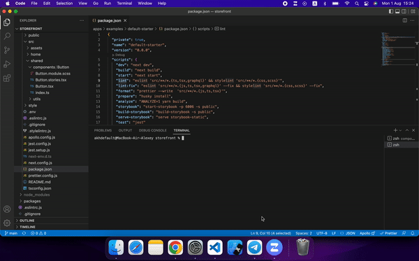

# Generate code (boilerplate)

Eslint config includes `templates` folder but `lint` script ignores it, as templates may have invalid code meant to be corrected after generation - Husky's `pre-push` needs to allow those.

## Component

`npx @mygento/gen -c` generates a React component from a template according to the selected options.

